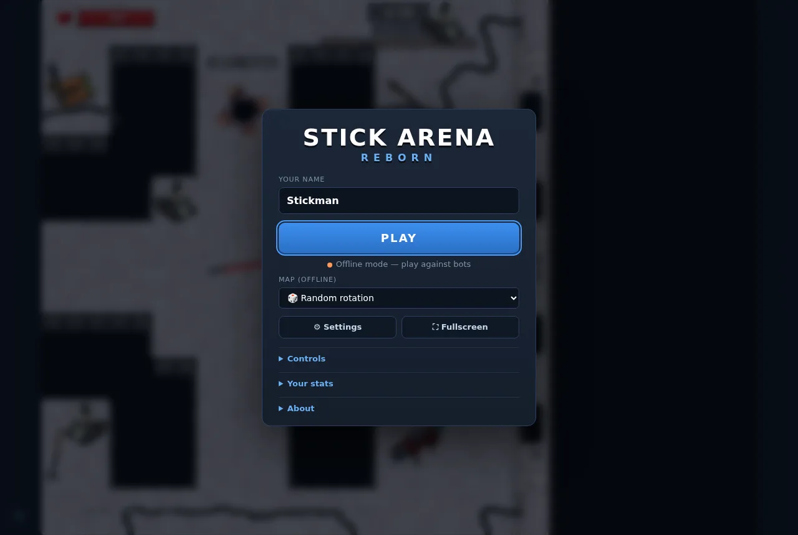
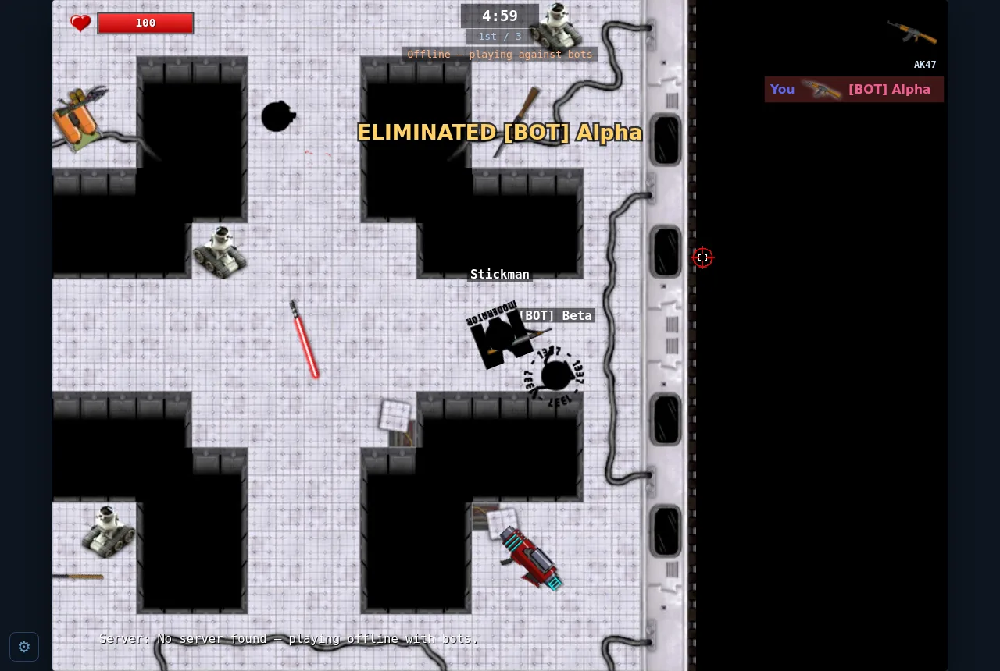
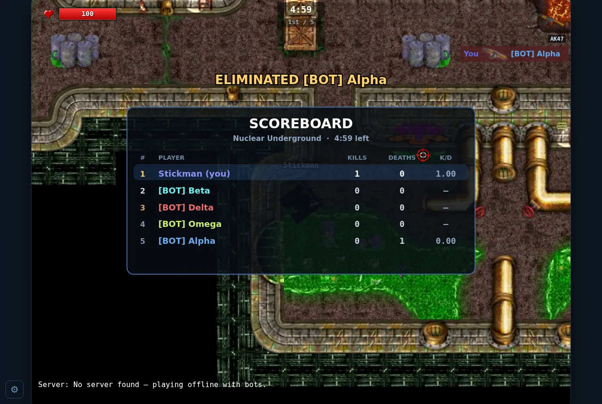
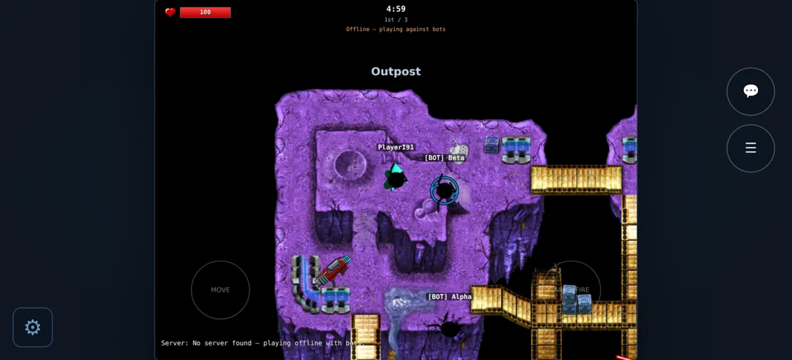

# Stick Arena: Reborn

A modern, open-source **HTML5 reimplementation** of the Flash game [Stick Arena](https://www.xgenstudios.com/play/stickarena) by XGenStudios.


| Menu | In game | Scoreboard | Phone (touch) |
|---|---|---|---|
|  |  |  |  |

> 🇹🇷 **Türkçe:** Oyun tarayıcı dili Türkçeyse otomatik olarak Türkçe açılır. İnternete açma adımları için: [DEPLOY.md](DEPLOY.md). Sunucu kurmak için: `npm install` ardından `npm start` → `http://localhost:1138`. Arkadaşlarınla oynamak için menüden **"Özel oda oluştur"** de ve davet linkini paylaş. Sunucu olmadan (GitHub Pages vb.) botlara karşı çevrimdışı oynanır; telefona/bilgisayara uygulama olarak da kurulabilir.

## Backstory

Stick Arena was a popular browser-based multiplayer shooter that ran for over a decade on XGenStudios' servers. When Adobe Flash was discontinued at the end of 2020, the game became effectively unplayable — the official servers eventually went offline, and today it can only be accessed through a Flash emulator paired with a private server.

This project preserves the game as a native HTML5 experience: no Flash, no plugins, no dead servers required.

## Features

- All original maps, weapons, and sprites — **gameplay and physics identical to the original** (locked by regression tests)
- **Offline bot mode** with 5‑minute rounds, scoreboard and map rotation — works on any static host (GitHub Pages) with no server
- **Multiplayer** — run the Node server to host your own game; bots fill in until a second player joins
- **Private rooms** — one click creates a room with an invite link (`?room=code`) to play with friends
- **Plays everywhere**: fills any window at 4:3, sharp on HiDPI/4K screens, fullscreen, phones and tablets
- **Controls**: keyboard (layout‑independent — works on Turkish/AZERTY/Dvorak), mouse, **gamepad**, and **twin‑stick touch controls**
- **Installable PWA** — add to home screen / desktop, plays offline
- Low‑latency **Web Audio** with volume control and optional positional sound
- English and **Turkish** UI (auto-detected)
- Modern HUD: kill feed, hit markers, damage direction, death screen, FPS & ping, reconnect banner
- Hardened server: input validation, anti‑forgery for damage, chat rate limits, admin auth

## Playing

### Offline (GitHub Pages / any static host)

Serve the `docs/` folder (or visit the GitHub Pages URL). The game detects that no server is available and starts a bot match automatically.

### Hosted multiplayer

```bash
npm install
npm start            # http://localhost:1138
```

Or with Docker:

```bash
docker compose up -d        # or: docker build -t stick-arena . && docker run -p 1138:1138 stick-arena
```

Players open `http://your-server:1138` and join the public room automatically. The static build (e.g. GitHub Pages) can also play online against any server: `https://<user>.github.io/<repo>/?server=https://your-server.example`. "Create private room" in the menu makes an invite link like `http://your-server:1138/?room=k3x9pq`; each room has its own map rotation, rounds and scores.

### Server configuration

| Variable | Default | Description |
|---|---|---|
| `PORT` | `1138` | HTTP / WebSocket port |
| `HOST` | all interfaces | Bind address |
| `ROUND_SECONDS` | `300` | Round length |
| `MAX_PLAYERS` | `16` | Players per room |
| `MAX_CONNECTIONS_PER_IP` | `32` | Simultaneous connections from one IP (needs `TRUST_PROXY` behind a proxy, or it applies to everyone at once) |
| `BANS_FILE` | – | JSON file where `!ban`s are persisted across restarts |
| `CORS_ORIGIN` | any | Comma-separated origins allowed to connect from other sites |
| `TRUST_PROXY` | off | Set to `1` behind nginx/Render/Fly etc. so real client IPs (bans, admin) are used |
| `ADMIN_PASSWORD` | – | Enables `!login <password>` for remote admins |

Health check: `GET /healthz` (JSON). Status page for hosts: `GET /status`.

### Admin chat commands

Available to LAN/localhost players (direct connections) or after `!login`:
`!next` (end round), `!kick <name>`, `!ban <name>`, `!weapon <id>`, `!debugmap`.

Client‑side: `!fps` (toggle FPS), `!debug` (collision overlay), and offline only `!map <name>`, `!next`.

## Controls

| Action | Keyboard / Mouse | Gamepad | Touch |
|---|---|---|---|
| Move | WASD / arrow keys | Left stick / D‑pad | Left thumb |
| Aim | Mouse | Right stick | Right thumb |
| Attack | Click / Space | RT / A / RB | Push right thumb past centre (tap = single shot) |
| Scoreboard | Tab / Shift (hold) | View / Back | ☰ button |
| Chat | Enter | – | 💬 button |
| Settings | Esc | Start | ⚙ button |
| Mute | M | – | Settings |

Walk over weapons to pick them up. Most kills when the timer runs out wins.

## Development

```bash
npm run dev     # server with auto-restart
npm test        # gameplay lock + server + input + i18n tests
npm run lint    # ESLint (catches undefined globals across the script files)
npm run e2e     # headless Chromium smoke test (needs `npx playwright install chromium`)
```

`test/golden.json` fingerprints every gameplay‑relevant calculation (constants, weapon stats, hit shapes, sub‑tile collision, line of sight and parsing of every map). If a change intentionally alters gameplay, regenerate it with `npm run golden:update` — otherwise a failing golden test means gameplay changed by accident.

The client is plain browser JavaScript (no build step) loaded in order by `docs/index.html`.

## Notes

Initial 'Stick Arena Reborn' project by WuggyRS.

Pets and some spinner animations are missing. There is no implementation of lobby / shop.

## Copyright

The game assets (sprites, maps, sounds) belong to **XGenStudios**. This project is for educational and preservational purposes only and may not be used for commercial purposes.

## License

No commercial use allowed.

This work is licensed under a [Creative Commons Attribution-NonCommercial-ShareAlike 4.0 International License][cc-by-nc-sa].

[cc-by-nc-sa]: http://creativecommons.org/licenses/by-nc-sa/4.0/
